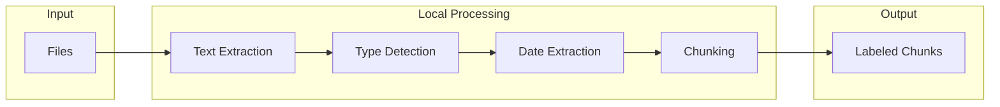
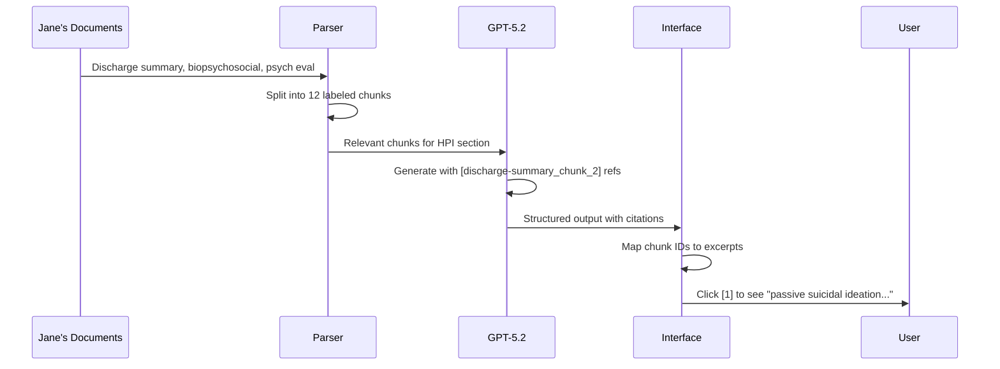
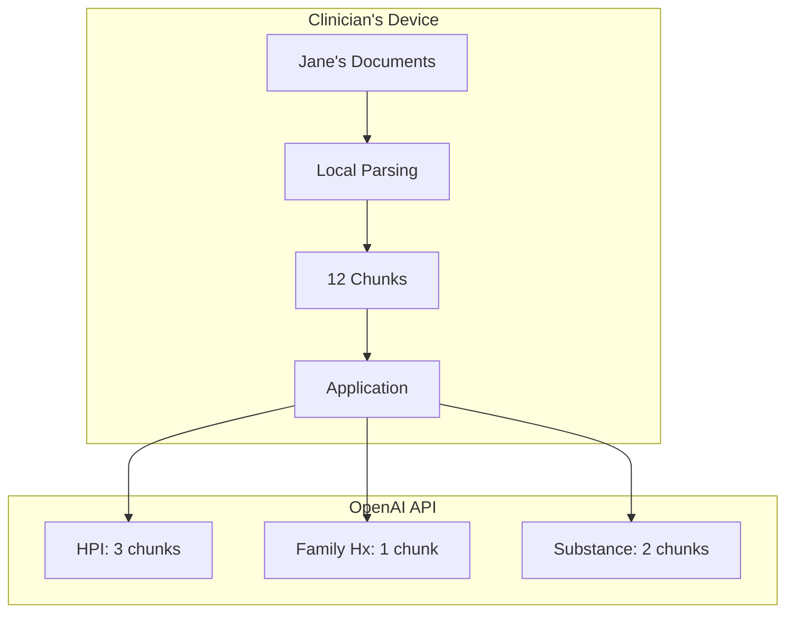
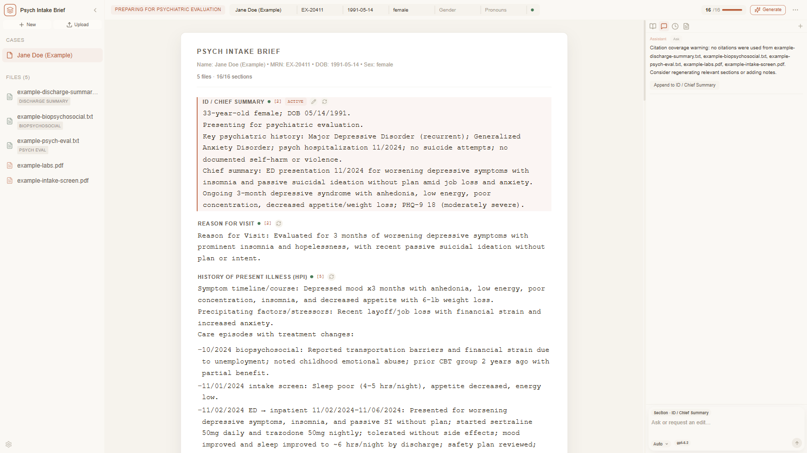
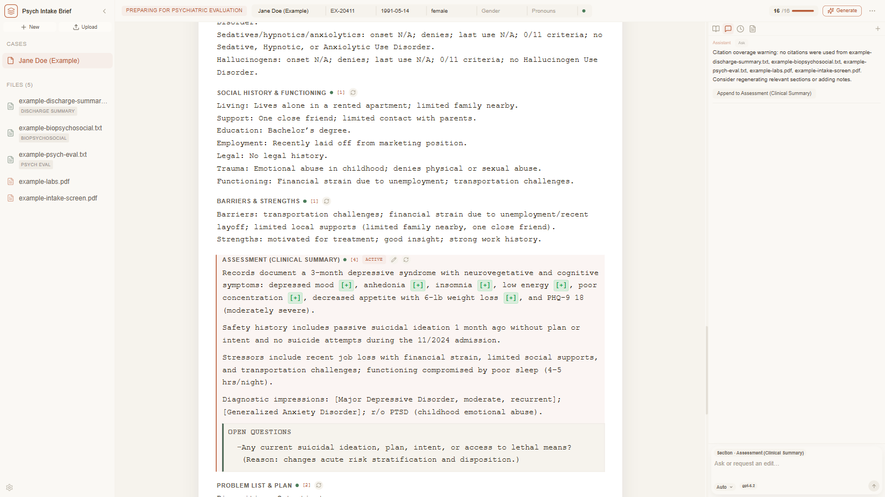
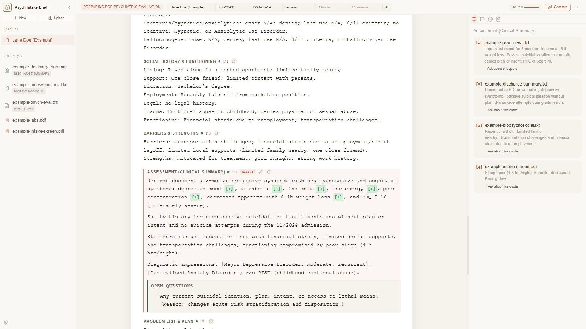

# Structured Harnesses for Clinical AI

This document looks at how the wrapper around a language model affects what you get out of it. We processed the same psychiatric case through ChatGPT and through a purpose-built tool called Psych Intake Brief. Both use GPT-5.2. The model is identical. The difference is in how the interaction gets structured.

This document examines what engineering choices actually matter for clinical documentation, and when they matter.

---

## The Problem

Psychiatric intake documentation involves synthesizing multiple source documents. Discharge summaries from prior hospitalizations. Outpatient progress notes. Biopsychosocial assessments. Psychological testing reports. Intake screening forms. These documents overlap in content but emphasize different things. A discharge summary focuses on treatment course. A biopsychosocial assessment focuses on developmental and social history. A psychiatric evaluation focuses on diagnostic formulation.

The clinician's job is to pull all of this into something coherent. That means arranging episodes chronologically across documents, avoiding redundant statements when multiple sources cover the same event, attributing claims to source material so they can be verified later, applying consistent notation like DSM-5 specifiers and substance use criteria counts, and flagging gaps where missing information affects the clinical picture.

Done manually, this takes 20-40 minutes per intake depending on complexity.

Language models can do this synthesis. The question is whether the interface you use to access the model changes the output in ways that matter.

---

## The Case

Jane is 33. Three months of worsening depression after losing her job. Passive suicidal ideation brought her to the ED. Four-day hospitalization. Started on sertraline 50mg and trazodone 50mg PRN. Discharged to outpatient care. At follow-up, sertraline went up to 100mg. PHQ-9 was 18, which is moderately severe.

Three documents tell the story: a discharge summary from November 6th, a biopsychosocial assessment from October 29th, and a psychiatric evaluation from November 15th. These are included with the application if you want to look at them yourself.

---

## ChatGPT

We pasted all three documents into ChatGPT with a simple prompt: "Please summarize this psychiatric intake for documentation."

The output was organized and accurate. The model created sections for Timeline of Care, Presenting Problem, History of Present Illness, Past Psychiatric History, Substance Use, and Treatment Plan. It got the key details right. PHQ-9 score of 18. Medication titration from sertraline 50mg to 100mg. Safety plan reviewed at discharge.

ChatGPT can produce citations if you ask. It can use DSM-5 specifiers if you ask. It can flag missing information if you ask. The model has these capabilities. The interface just does not enforce them. Every session starts fresh. You have to remember to specify your requirements each time. Forget to ask for citations, no citations. Forget DSM specifiers, informal diagnostic language. Different prompt, different format.

The variability stems from the interface.

---

## Psych Intake Brief

This tool uses the same GPT-5.2 model via API. The difference is the wrapper. The wrapper automates operations that would otherwise require manual prompting every time.

Here is what happens under the hood.

---

## Document Processing

Source: `src/lib/parser.ts`

When you upload files, they get processed locally on your machine. The app uses pdfjs-dist for PDFs, mammoth for DOCX files, and native text reading for plain text. No raw files leave your device.

After extracting the text, the system does three things. First, it classifies each document by type. Regex patterns look for phrases like "discharge summary" or "psychiatric evaluation" or "biopsychosocial" and tag the document accordingly. For Jane's case, the discharge summary gets tagged automatically because it contains the phrase "Date of Discharge: 11/06/2024."

Second, it tries to extract service dates. Jane's discharge summary yields 11/06/2024, the biopsychosocial yields 10/29/2024, and the psych eval yields 11/15/2024. This helps with chronological organization.

Third, it splits the text into chunks. Here is what a chunk from Jane's discharge summary actually looks like:

```
[discharge-summary_chunk_2]
Patient was admitted on 11/02/2024 with passive suicidal ideation in the 
context of worsening depression following job loss. She denied active plan 
or intent. Started on sertraline 50mg daily and trazodone 50mg PRN for 
insomnia. By day 3, patient reported improved sleep and denied SI...
```

Each chunk gets a unique identifier. These identifiers become important later for citation tracking.



---

## Evidence Ranking

Source: `src/lib/evidence.ts`

Not all chunks are relevant to every section. When generating the Substance Use section for Jane, the system needs chunks mentioning alcohol or cannabis, not chunks about her hospitalization timeline.

The system tokenizes the section guidance and scores chunks by matching tokens. For Jane's Substance Use section, the guidance includes "substance," "alcohol," "cannabis," "criteria," "onset." Chunks from the biopsychosocial assessment score highest because that document contains:

```
[biopsychosocial_chunk_4]
Substance Use History: Patient reports drinking 1-2 alcoholic beverages on 
weekends socially. Denies history of blackouts or withdrawal symptoms. 
Occasional cannabis use, approximately 1-2 times per month. Denies tobacco, 
opioids, stimulants, or other substances...
```

There is also source diversification. If all the top-scoring chunks came from the biopsychosocial, the system would still pull in the best chunk from the discharge summary and psych eval. In Jane's case, the discharge summary mentions "UDS negative" which adds verification context.

---

## LLM Orchestration

Source: `src/lib/llm.ts`

The core architectural decision is making separate API calls for each section of the template. For Jane's case, generating the Substance Use section sends only substance-related chunks to the API, along with section-specific guidance.

Here is what the actual API call looks like for Jane's Substance Use section:

```
System: Role: Psychiatrist preparing colleague for patient interview.
        DSM-5 notation: [+] met, [-] not met, [?] unknown, [p] partial
        SUD severity: mild (2-3 criteria), moderate (4-5), severe (6+)
        Every fact requires citation [chunkId]. Omit unsupported statements.

User:   Section: Substance Use History
        Guidance: One line per substance. MUST include X/11 criteria count.
        Format: "[Substance]: [onset]; [pattern]; [last use]; [X]/11 criteria; [Dx]"
        
        Evidence:
        [biopsychosocial_chunk_4] Substance Use History: Patient reports 
        drinking 1-2 alcoholic beverages on weekends socially...
        [discharge-summary_chunk_5] UDS was negative on admission...
```

The model returns structured JSON with both text and citations:

```json
{
  "text": "Alcohol: onset not documented; 1-2 drinks/weekends; last use not documented; 0/11 criteria; no AUD.\nCannabis: onset not documented; 1-2x/month; last use not documented; 0/11 criteria; no CUD.",
  "citations": [
    {"chunkId": "biopsychosocial_chunk_4", "excerpt": "1-2 alcoholic beverages on weekends socially"},
    {"chunkId": "biopsychosocial_chunk_4", "excerpt": "Occasional cannabis use, approximately 1-2 times per month"}
  ]
}
```

The JSON schema forces the model to either cite or omit. It cannot make claims without attempting citations.

```mermaid
flowchart TB
  subgraph prep [Per-Section Preparation]
    E[Ranked Evidence]
    G[Section Guidance]
    D[DSM Context]
    P[Prior Sections]
  end
  subgraph call [API Call]
    I[System Instructions]
    S[JSON Schema]
  end
  subgraph out [Output]
    T[Text]
    C[Citations]
  end
  E --> I
  G --> I
  D --> I
  P --> I
  I --> S --> T
  S --> C
```

---

## Template System

Source: `src/lib/template.ts`

The template defines 17 sections. Each has format guidance that tells the model exactly what to produce.

For Jane's Problem List, the guidance specifies the DSM-5-TR specifier chain format. The model receives: "Start with disposition header, then numbered problems using full DSM-5-TR specifier chain. Format: [Disorder], [severity], [course], [features]."

The output for Jane:

```
Disposition: Outpatient; Safety plan: reviewed 11/06/2024; Follow-up: psychiatry 2 weeks

1. Major Depressive Disorder, recurrent, moderate, with anxious distress
2. Insomnia Disorder, episodic
```

Compare this to ChatGPT's output with no guidance: "Major Depressive Disorder, recurrent, moderate." The specifiers come from embedded instructions, not different model capability.

---

## DSM Integration

Source: `src/lib/dsm.ts`

For Jane's DSM-5 Criteria Analysis section, the system injects Major Depressive Disorder criteria as reference material. It detects "depression" in the content and retrieves the relevant criteria block:

```
Major Depressive Episode Criteria:
A. Five or more of the following symptoms present during the same 2-week period:
   (1) Depressed mood most of the day, nearly every day
   (2) Markedly diminished interest or pleasure
   (3) Significant weight loss or gain
   (4) Insomnia or hypersomnia
   (5) Psychomotor agitation or retardation
   ...
```

The model uses this reference to produce structured notation:

```
MDD (meets criteria)
A1 depressed mood [+] — "feeling down 3 months"
A2 anhedonia [+] — "no interest in activities"
A3 weight [+] — "6-lb weight loss"
A4 sleep [+] — "insomnia, 4-5 hours/night"
A5 psychomotor [-]
A6 fatigue [+] — "low energy"
A7 worthlessness [?]
A8 concentration [+] — "poor concentration at work"
A9 SI [+] — "passive SI, no plan"
Threshold: 7/9, required 5+ [MET]
```

This DSM context goes to the model as reference material. The [+] markers cite Jane's clinical documents.

---

## Output Processing

Sources: `src/lib/textUtils.ts` and `src/components/Markdown.tsx`

The model includes chunk IDs in its raw output for citation tracking. Before display, the system strips them out.

Raw model output for Jane's HPI:

```
Depressed mood x3 months with anhedonia, insomnia (4-5 hrs/night), 
decreased appetite, 6-lb weight loss [discharge-summary_chunk_2]. 
Precipitating stressor: job loss with financial strain [biopsychosocial_chunk_3].
```

After processing:

```
Depressed mood x3 months with anhedonia, insomnia (4-5 hrs/night), 
decreased appetite, 6-lb weight loss. Precipitating stressor: job loss 
with financial strain.
```

The chunk IDs get mapped to clickable citation numbers in the interface. The clinician sees clean text with [1], [2] references that link to the evidence panel.

The markdown renderer also converts DSM notation into color-coded badges. Jane's criteria analysis shows green [+] for met criteria and orange [?] for unknown, making it easy to scan for diagnostic uncertainty.

---

## Citation System

The flow connects model output back to source documents. For Jane's case:



Click a citation number and the evidence panel shows the source excerpt. For Jane's PHQ-9 score of 18, clicking the citation shows: "PHQ-9: 18/27 indicating moderately severe depression" from the psychiatric evaluation.

---

## Privacy Considerations

The architecture makes specific choices about data handling. For Jane's case:

Document text extraction happens locally. Jane's PDF discharge summary never leaves your machine. Only extracted text travels to the API.

Per-section API calls mean no single request contains Jane's complete record. The HPI call includes chunks from all three documents. The Family History call includes only one. An adversary intercepting API traffic would see fragments:

```
Request 1 (HPI): discharge-summary_chunk_2, biopsychosocial_chunk_3, psych-eval_chunk_1
Request 2 (Family Hx): biopsychosocial_chunk_7
Request 3 (Substance Use): biopsychosocial_chunk_4, discharge-summary_chunk_5
...
```

No single request contains Jane's full hospitalization narrative, substance history, family history, and treatment plan together.



All API calls include `store: false`, telling OpenAI not to retain Jane's data for training. Your API key goes directly to OpenAI with no intermediary.

HIPAA compliance requires legal analysis of your specific deployment context. These are architectural choices to minimize data aggregation.

---

## What Changes in the Output

The output differences for Jane reflect the embedded instructions.

Diagnostic notation:
- ChatGPT: "Major Depressive Disorder, recurrent, moderate"
- Psych Intake Brief: "Major Depressive Disorder, recurrent, moderate, with anxious distress"

Substance use:
- ChatGPT: "1-2 drinks on weekends"
- Psych Intake Brief: "Alcohol: onset not documented; 1-2 drinks/weekends; last use not documented; 0/11 criteria; no AUD"

Gap identification for Jane (automatic):
```
Family psychiatric history: Not documented.

Open questions:
- Any family history of mood disorders, psychosis, suicide, or substance use? 
  (Reason: guides diagnostic consideration and medication selection)
```

---

## Comparison

| Aspect | ChatGPT | Psych Intake Brief |
|--------|---------|-------------------|
| Data handling | Complete record in single request | Fragmented across N requests |
| Citations | Available when prompted | Automatic with schema enforcement |
| DSM notation | Available when prompted | Embedded in template |
| Format consistency | Varies by session | Enforced by schema |
| Verification | Manual document search | Click-to-excerpt |
| Section structure | User-specified each time | Predefined template |
| Gap flagging | Available when prompted | Automatic with rationale |
| Source diversification | Model discretion | Algorithmic |
| Local processing | None | PDF/DOCX on device |
| Data retention | Per OpenAI settings | Explicitly disabled |

---

## Visual Interface



Three panels. Left shows Jane's uploaded documents with detected types (discharge-summary, biopsychosocial, psych-eval). Center shows the generated summary with section navigation. Right provides evidence viewing and chat follow-up.



Jane's DSM-5 Criteria Analysis with color-coded badges. Green [+] for criteria met, orange [?] for unknown. Helps scan for diagnostic uncertainty quickly.



The evidence panel showing Jane's source excerpts. Click citation [2] to see "passive suicidal ideation in the context of worsening depression" from the discharge summary.

---

## What This Does and Does Not Solve

The harness addresses consistency. Every intake gets the same format. Jane's summary uses the same notation as the next patient.

It addresses verification. Jane's PHQ-9 score of 18 has a clickable citation. One click shows the source.

It addresses completeness. Seventeen predefined sections ensure Jane's family history gap gets flagged automatically.

It does not address model limitations. If GPT-5.2 misreads Jane's medication dose, the harness does not catch it.

It does not address EHR integration. Jane's summary exports to DOCX or PDF. Getting it into Epic requires additional work.

It does not address regulatory compliance. Whether processing Jane's records this way meets HIPAA depends on your deployment context.

---

## When to Use Which

ChatGPT works when you are comfortable with prompt engineering, when format requirements vary, for one-off tasks, or when citation verification does not matter.

The structured harness works when consistent format is required across many patients like Jane, when verification matters, when multiple clinicians need identical conventions, or when workflow efficiency outweighs flexibility.

The harness provides structure at the cost of flexibility.

Source materials including Jane's documents and all code are available for independent evaluation.
